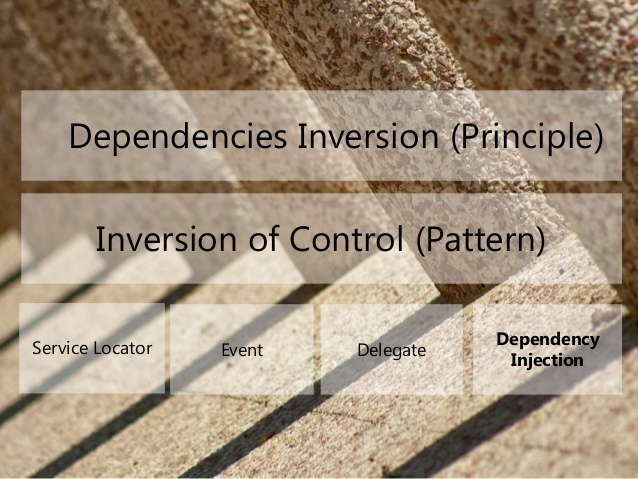

Dependency inversion: is a Principle
- High-level modules should not depend on low-level modules. Both should depend on abstractions.
- Abstractions should not depend on details. Details should depend on abstractions.

Inversion of control: is a design pattern
- Dependency Injection (DI)
- Event-Driven Programming
- Template Method Design Pattern
- Strategy Pattern
- Factory Pattern
- Service Locator Patter

Dependency injection: is the most common form of IoC
- Props:
  - Decoupling
  - Code reuse
  - Easier testing
  - Code maintainability
- Cons:
  - Complexity
  - Hard to understand
  - Debugging
  - Require more code
  - Performance

